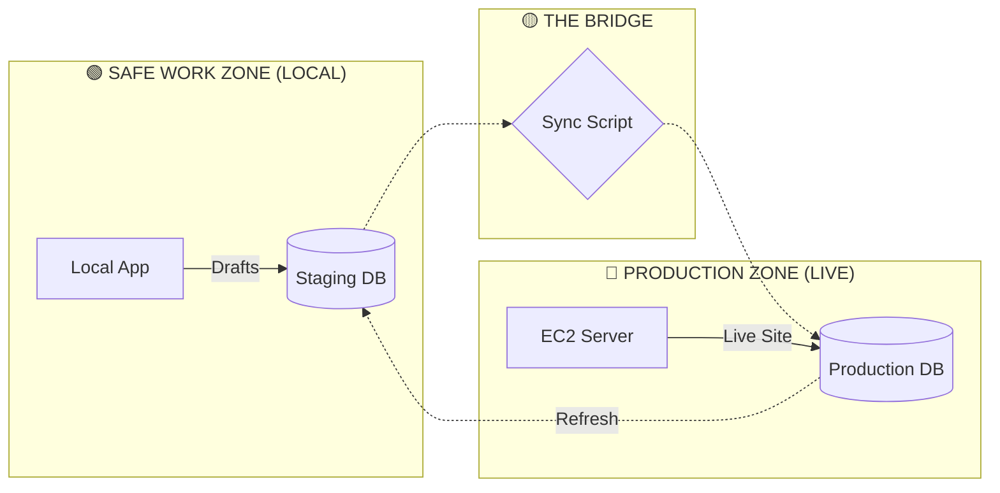

# 🛠️ AUTOFORM TECHNICAL INFRASTRUCTURE: MASTER REFERENCE
**Status:** Operational | **Revision:** 2.0 (April 2026)

---

## 📊 SYSTEM VISUALIZATION

---

## 📋 ENDPOINT REGISTRY

### 🖥️ Production Environment (THE LIVE SITE)
| Variable Name | Value |
| :--- | :--- |
| **DATABASE_HOST** | `autoformdb-rollback.cpqpdscnexwq.ap-south-1.rds.amazonaws.com` |
| **DATABASE_NAME** | `dev-autoform` |
| **DB_USER / PASSWORD** | `admin` / `Autoform123` |

### 🧪 Staging Environment (THE DRAFTING TABLE)
| Variable Name | Value |
| :--- | :--- |
| **STAGING_HOST** | `staging-autoformdb.cpqpdscnexwq.ap-south-1.rds.amazonaws.com` |
| **STAGING_NAME** | `dev-autoform` |

---

## 🛡️ THREE RULES OF SAFETY
1. **NEVER** connect your local machine to the Production DB URL.
2. **ALWAYS** verify changes on `localhost` before syncing to live.
3. **ONLY** sync Categories and Products. Never touch user or order data.

---

## ⌨️ CLI CHEATSHEET (On Server)

| Task | Command |
| :--- | :--- |
| **Go Live (Sync)** | `node src/scripts/syncProducts.cjs` |
| **Emergency Check** | `node src/scripts/deepAudit.cjs` |
| **Restart App** | `pm2 restart autoformbackend --update-env` |
| **View Live Logs** | `pm2 logs autoformbackend --lines 50` |

---
**Note:** In case of emergency missing prices, restore RDS to `10:20 AM` (April 08, 2026).
